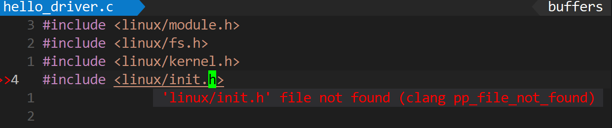
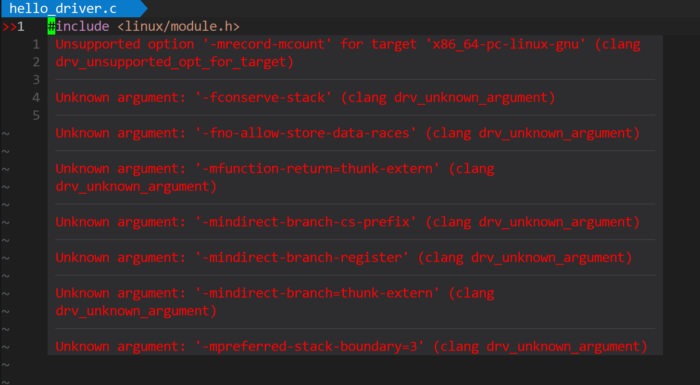

# 花里胡哨的VIM

---

## 一、前期准备工作

1.VIM版本要为9.0以上，自行检查，如果不是的话，使用PPA安装
```bash
sudo add-apt-repository ppa:jonathonf/vim
sudo apt update
sudo apt install vim
```

建议去官方github拉取最新版(基于Ubuntu22.04-LTS jammy 版本，旧版本镜像可能无法使用):[下载地址](https://github.com/vim/vim-appimage/releases)。如果使用PPA安装的话可能会安装较旧的版本，导致部分插件功能无法使用。

安装过程举例：
```bash
#切换到这个目录
cd /usr/local/bin
#使用wget拉取
wget https://github.com/vim/vim-appimage/releases/download/v9.1.2110/Vim-v9.1.2110.glibc2.34-x86_64.AppImage -O vim_new
#修改权限
chmod +x vim_new
# 备份旧的 vim (是个好习惯)
mv /usr/bin/vim /usr/bin/vim.old
# 建立软链接
ln -s /usr/local/bin/vim_new /usr/bin/vim
#最后进入vim查看版本
```
>如果网络太差，wget失败或者太慢的话，也可以手动下载AppImage文件然后传输到这个目录，重命名为vim_new再进行手动替换。

2.将系统中的 Node.js 升级到最新的 LTS 版本（通常推荐 v18 或 v20）
移除旧版本：
```bash
sudo apt remove nodejs
```

添加 NodeSource 源（安装 v20 LTS 版本）：
```bash
curl -fsSL https://deb.nodesource.com/setup_20.x | bash -
```

安装新版本：
```bash
sudo apt install -y nodejs
```
>如果旧版没卸载干净可能会有报错，根据报错内容自行清理。

验证版本：
```bash
node -v
# 输出应该类似 v20.x.x
```

3.安装clangd
```bash
sudo apt install clang clangd
```

4.安装插件管理器 (Vim-Plug)
```bash
curl -fLo ~/.vim/autoload/plug.vim --create-dirs \
    https://raw.githubusercontent.com/junegunn/vim-plug/master/plug.vim
```

## 二、vim配置文件

~/.vimrc
```vim
" ====================================================================
" 1. 插件管理 (Plug)
" ====================================================================
call plug#begin('~/.vim/plugged')

" --- 核心大脑 ---
Plug 'neoclide/coc.nvim', {'branch': 'release'}

" --- 颜值与界面 ---
Plug 'tomasiser/vim-code-dark'          " VSCode 主题
Plug 'sainnhe/gruvbox-material'         "经典的深色主题 (护眼)
Plug 'vim-airline/vim-airline'          " 状态栏
Plug 'vim-airline/vim-airline-themes'   " 状态栏主题
Plug 'ryanoasis/vim-devicons'           " 文件图标(必须安装 Nerd Font)

" --- C++ 语法高亮增强 (支持 Vim 9) ---
Plug 'bfrg/vim-cpp-modern'

" --- 效率工具 ---
Plug 'preservim/nerdtree'               " 文件树
Plug 'junegunn/fzf', { 'do': { -> fzf#install() } } " 模糊搜索核心
Plug 'junegunn/fzf.vim'                 " 模糊搜索插件
Plug 'tpope/vim-commentary'             " 快速注释 (gcc)
Plug 'tpope/vim-surround'               " 包裹修改 (cs')
Plug 'jiangmiao/auto-pairs'             " 自动补全括号
Plug 'voldikss/vim-floaterm'            " 悬浮终端
Plug 'puremourning/vimspector'          " 调试器
Plug 'ojroques/vim-oscyank', {'branch': 'main'} " 剪切板同步

call plug#end()

" ====================================================================
" 2. 基础设置 
" ====================================================================
set nocompatible
filetype plugin indent on
syntax on

" --- 关键 ---
set hidden                  " 允许在未保存时切换缓冲区
set updatetime=100          " 缩短更新时间 
set shortmess+=c            " 补全时不显示啰嗦的匹配信息
set signcolumn=yes          " 强制显示左侧符号列 (防止报错时屏幕抖动)

" --- 编辑体验 ---
set number relativenumber   " 显示行号和相对行号 (方便跳转)
set cursorline              " 高亮当前行
set expandtab               " Tab 转空格
set tabstop=4               " Tab 宽度 4
set shiftwidth=4            " 缩进宽度 4
set autoindent
set smartindent
set mouse=a                 " 允许鼠标操作(偶尔点点很方便)
                            " 按住shift键鼠标可以切换为原来的选中模式
"set encoding=utf-8
set clipboard=unnamed       " 尝试与系统剪贴板互通

" 搜索忽略大小写，除非包含大写
set ignorecase
set smartcase

" 也就是 Backspace 可以删掉任何东西
set backspace=indent,eol,start

" --- 持久化撤销  ---
" 即使关闭 Vim，再次打开文件也能撤销之前的修改
set undofile
set undodir=~/.vim/undodir
if !isdirectory(&undodir)
    call mkdir(&undodir, "p", 0700)
endif

" ====================================================================
" 3. 主题与显示
" ====================================================================
" 强制开启真彩色 
set termguicolors

" 设置背景为深色
set background=dark
" 启用 codedark 主题
colorscheme codedark
" 启用 Gruvbox Material 主题
"let g:gruvbox_material_background = 'hard'
"colorscheme gruvbox-material
" 状态栏设置
let g:airline_theme = 'codedark'
"let g:airline_theme = 'gruvbox_material'
let g:airline#extensions#tabline#enabled = 1  " 开启顶部 Tab 列表
let g:airline_powerline_fonts = 1             " 使用箭头字体

" ====================================================================
" 4. 核心键位映射 (Space Leader)
" ====================================================================
let mapleader=" "

" 常用快捷键
nnoremap <Leader>w :w<CR>
nnoremap <Leader>q :q<CR>
nnoremap <Leader>l :nohlsearch<CR>

" 文件树
nnoremap <Leader>e :NERDTreeToggle<CR>
nnoremap <Leader>f :NERDTreeFind<CR>

" 模糊搜索
nnoremap <Leader>p :Files<CR>
nnoremap <Leader>s :Rg<CR>

" 悬浮终端 (F2)
nnoremap <F2> :FloatermToggle<CR>
tnoremap <F2> <C-\><C-n>:FloatermToggle<CR>

" 调试 (F5/F9)
nmap <F5> <Plug>VimspectorContinue
nmap <F9> <Plug>VimspectorToggleBreakpoint
nmap <F10> <Plug>VimspectorStepOver
nmap <F11> <Plug>VimspectorStepInto

" --- 窗口切换 (Ctrl + hjkl) ---
nnoremap <C-h> <C-w>h
nnoremap <C-j> <C-w>j
nnoremap <C-k> <C-w>k
nnoremap <C-l> <C-w>l
" ====================================================================
" 5. Coc.nvim 深度配置
" ====================================================================

" --- 必须定义的 CheckBackspace 函数 ---
" 没有这个，Tab 键补全会直接报错
function! CheckBackspace() abort
  let col = col('.') - 1
  return !col || getline('.')[col - 1]  =~# '\s'
endfunction

" --- Tab 键逻辑：有补全选补全，没补全插入 Tab ---
inoremap <silent><expr> <TAB>
      \ coc#pum#visible() ? coc#pum#next(1) :
      \ CheckBackspace() ? "\<Tab>" :
      \ coc#refresh()
inoremap <expr><S-TAB> coc#pum#visible() ? coc#pum#prev(1) : "\<C-h>"

" 回车选中补全
inoremap <silent><expr> <CR> coc#pum#visible() ? coc#pum#confirm()
                              \: "\<C-g>u\<CR>\<c-r>=coc#on_enter()\<CR>"

" ---ShowDocumentation 函数 ---
" 用于 K 键查看文档
function! ShowDocumentation()
  if (index(['vim','help'], &filetype) >= 0)
    execute 'h '.expand('<cword>')
  elseif (coc#rpc#ready())
    call CocActionAsync('doHover')
  else
    execute '!' . &keywordprg . " " . expand('<cword>')
  endif
endfunction

" 常用跳转键位
nmap <silent> gd <Plug>(coc-definition)
nmap <silent> gy <Plug>(coc-type-definition)
nmap <silent> gi <Plug>(coc-implementation)
nmap <silent> gr <Plug>(coc-references)
" K 键查文档 (现在不会报错了)
nnoremap <silent> K :call ShowDocumentation()<CR>

" 重命名与格式化
nmap <leader>rn <Plug>(coc-rename)
nmap <leader>fm :call CocAction('format')<CR>


" --- OSC Yank 配置 ---
" 只有在支持 OSC52 的终端中才生效
let g:oscyank_term = 'default'
" 自动把 Vim 的 yank 操作同步到系统剪切板
autocmd TextYankPost * if v:event.operator is 'y' && v:event.regname is '' | OSCYank | endif
```
文件中已经添加了仿vscode和gruvbox主题，可根据需要自行修改。

修改完配置文件后重新打开vim，运行
```
:PlugInstall
```
安装相应的插件

然后安装 Coc 扩展,继续在vim中运行
```
:CocInstall coc-clangd coc-cmake coc-json coc-sh coc-vimlsp
```

可选项：
安装调试器适配器
```
:VimspectorInstall vscode-cpptools
```

安装Nerd Font字体，官网地址：[font-downloads](https://www.nerdfonts.com/font-downloads)下载一款字体，推荐 "JetBrainsMono Nerd Font"。

* **注意：如果进行c/c++开发，尤其是Linux驱动，可进行如下配置**

这样可以解决一些找不到头文件的问题，如图：


如果使用cmake构建项目，在执行编译时添加参数：

```cmake
-DCMAKE_EXPORT_COMPILE_COMMANDS=1
```
然后把生成的 `compile_commands.json` 复制或软链接到项目根目录。

如果使用make构建，可以安装bear

```bash
apt install bear
```

然后在编译时使用bear拦截编译参数

```bash
bear -- make
```
bear 会在当前目录下生成` compile_commands.json`只需要修改其中的内容就可以了。

这时候再重新用vim打开代码，可能会出现如下报错：


这是因为目前使用的是GCC 编译器，并且开启了许多 GCC 专有的优化选项（比如 `-mrecord-mcount`, `-fconserve-stack` 等）。 而提供代码补全的 Clangd 是基于 LLVM/Clang 的，它不认识这些 GCC 的优化选项。解决方案就是添加一个配置文件，让Clangd忽略这些选项就可以了。

在当前项目根目录下新建一个.clangd配置文件，填入如下内容：

```yaml
CompileFlags:
  Remove:
    - -mrecord-mcount
    - -fconserve-stack
    - -fno-allow-store-data-races
    - -mfunction-return=thunk-extern
    - -mindirect-branch-cs-prefix
    - -mindirect-branch-register
    - -mindirect-branch=thunk-extern
    - -mpreferred-stack-boundary=3
```
然后重启vim就好了。

也可以去用户的全局目录下创建相应的文件，这样就不用每次新建项目都去添加一次配置文件。

```bash
mkdir -p ~/.config/clangd
vim ~/.config/clangd/config.yaml
```
同样写入上面的相关内容然后保存即可，如果还有别的报错，也可以根据log信息去加入对应的参数。

* 使用代码格式化时，可以在项目根目录创建一个名为 `.clang-format` 的文件，写入以下内容：

```yaml
BasedOnStyle: Google
IndentWidth: 4
TabWidth: 4
UseTab: Never
BreakBeforeBraces: Linux
AllowShortIfStatementsOnASingleLine: false
IndentCaseLabels: false
ColumnLimit: 80
AccessModifierOffset: -4
```
这部分内容可根据使用习惯定制，自行参考clang-format的配置。

---


## 三、部分配置使用说明书


### 前言：核心操作逻辑

在这套配置中，所有的“魔法”都基于两个核心概念：

1. **Leader Key (空格键 Space)**：这是你的“指挥官键”。几乎所有自定义的高级功能都以 `<空格>` 开头。
* 按下 空格 + w = 保存 (Write)
* 按下 空格 + q = 退出 (Quit)
* 按下 空格 + l = 清除高亮 (Clear Highlight)

2. **模式切换**：
* **普通模式 (Normal)**：默认模式，用于移动、浏览、按快捷键。按 `Esc` 总是回到这里。
* **插入模式 (Insert)**：按 `i` 进入，像记事本一样打字。
* **可视模式 (Visual)**：按 `v` 进入，用于选中代码块。

---

### 第一章：项目管理与文件浏览

这部分解决“如何在成百上千个文件中快速穿梭”的问题。

#### 1. 文件资源管理器 (NERDTree)

**场景**：你需要查看项目目录结构，新建、删除或重命名文件。

* **打开/关闭侧边栏**：`<空格> + e`
* **在侧边栏中的操作**（光标在左侧文件树时）：
* `o` (小写)：打开光标下的文件。
* `s`：**分屏打开**（左右分屏），在对比代码时非常有用。
* `i`：**水平分屏打开**（上下分屏）。
* `C` (大写)：将当前选中的目录设置为“根目录”（进入子文件夹）。
* `u`：返回上一级目录。
* `I` (大写)：切换显示/隐藏文件（如 `.git` 或 `.o` 文件）。
* **`m` (关键功能)**：**唤出菜单**。按 `m` 后你会看到底部出现选项：
* 输入 `a`：**新建文件或文件夹**（输入名字以 `/` 结尾自动变成文件夹）。
* 输入 `d`：**删除**当前文件。
* 输入 `m`：**重命名/移动**文件。

#### 2. 模糊搜索神器 (FZF - Files)

**场景**：你知道文件名，想秒开，不希望在目录树里一层层点。

* **启动搜索**：`<空格> + p`
* **使用技巧**：
* **模糊匹配**：找 `driver/usb/usb_core.c`，只需输入 `drusbc` 即可匹配。
* **打开方式**：
* `Enter`：直接打开。
* `Ctrl + x`：在上下分屏中打开。
* `Ctrl + v`：在左右分屏中打开。
* `Ctrl + t`：在新标签页 (Tab) 中打开。

#### 3. 全局代码搜索 (RipGrep - Rg)

**场景**：你想找 `MyStruct` 结构体在哪些文件里被定义或使用了。

* **启动搜索**：`<空格> + s`
* **使用技巧**：
* 输入代码片段，列表会实时更新。
* 按 `Enter` 跳转到对应行。
* **高级技巧**：搜索完毕后，按 `Alt + a` 可以把所有搜索结果放入 QuickFix 列表，方便批量处理（配合 `:copen`）。

---

### 第二章：代码编写与智能辅助 (IDE 核心)

这部分由 **Coc.nvim** 提供支持，体验类似 VS Code。

#### 1. 智能补全

* **触发**：输入代码时自动弹出。
* **选择**：
* `Tab`：向下选择。
* `Shift + Tab`：向上选择。
* `Enter`：确认选中。


* **参数提示**：当你输入函数参数时（例如 `func(`），如果配置正确，Vim 会在悬浮窗提示当前应该是哪个参数（int a, string b...）。

#### 2. 代码导航 (跳转)

这是阅读大型 C++ 项目（如 Linux 内核或 BSP）时的神技。

* **跳转到定义 (Go Definition)**：`gd`
* 光标在 `func()` 上按 `gd`，直接跳到函数实现处。


* **跳转到引用 (Go References)**：`gr`
* 想看谁调用了这个函数？按 `gr`，会弹出一个列表显示所有调用点。


* **查看文档 (Hover)**：`K` (大写)
* 光标下的变量类型是什么？函数注释是什么？按 `K` 查看悬浮窗。


* **跳转历史 (Time Travel)**：
* **`Ctrl + o`**：**回到上一个位置**（比如你按 `gd` 跳走了，看一眼想回去，就按这个）。
* **`Ctrl + i`**：前进到下一个位置。

#### 3. 诊断与修复 (报错处理)

* **实时报错**：代码写错时，行号左边会出现红色 `>>` 或 `E` 标志，代码下方有波浪线。
* **查看报错详情**：
* 光标移到波浪线上，稍微停顿，会显示错误信息。
* 或者按 `[g` （跳转到上一个错误）和 `]g` （跳转到下一个错误）。


* **快速修复 (Quick Fix)**：
* 如果在报错行按 `<空格> + a` (CocAction)，如果有自动修复方案（如缺少头文件），它会提示你直接应用。

#### 4. 代码重构

* **重命名 (Rename)**：`<空格> + rn`
* 修改变量名，项目中所有引用该变量的地方都会自动修改（比简单的查找替换安全得多）。


* **格式化 (Format)**：`<空格> + fm`
* 调用 `clang-format` 自动排版当前文件。

---

### 第三章：极速编辑

这部分是 Vim 超越普通 IDE 的地方，主要依靠 `vim-surround` 和 `auto-pairs`。

#### 1. 包裹修改 (Surround) - 必须掌握

**口诀**：`c` (改变), `d` (删除), `y` (添加), `s` (Surround 包裹物)。

* **场景 A：把双引号改单引号**
* 代码：`"Hello World"`
* 操作：光标在引号内，按 `cs"'` (Change Surround " to ')
* 结果：`'Hello World'`

* **场景 B：删除括号**
* 代码：`(int a)`
* 操作：光标在括号内，按 `ds(` (Delete Surround ()
* 结果：`int a`

* **场景 C：给单词加括号/引号 (最常用)**
* 代码：`return x;` -> 想变成 `return (x);`
* 操作：光标在 `x` 上，按 `ysiw)` (You Surround Inner Word with ) )
* 结果：`return (x);`
* *注：如果按 `ysiw(` (左括号)，会在括号内加空格 `( x )`；按右括号则不加空格。*

#### 2. 快速注释

* **注释当前行**：`gcc`
* **注释多行**：
1. 按 `v` 进入可视模式。
2. 按 `j` 或 `k` 选中多行。
3. 按 `gc`。


* **解开注释**：重复上述操作即可。

#### 3. 括号补全

* 输入 `(` 自动补全 `)`，光标在中间。
* 输入 `{` 并回车，自动补全 `}` 并换行缩进（C++ 写函数时极爽）。

---

### 第四章：窗口与终端管理

#### 1. 窗口分屏与切换

**场景**：左边看头文件 `header.h`，右边写实现 `source.cpp`。

* **分屏操作**：
* `:vsp` (Vertical Split)：左右分屏。
* `:sp` (Split)：上下分屏。


* **窗口间移动光标**（已配置为快捷键）：
* `Ctrl + h`：去左边窗口。
* `Ctrl + l`：去右边窗口。
* `Ctrl + j`：去下边窗口。
* `Ctrl + k`：去上边窗口。


* **调整窗口大小**：
* `:vertical resize +5` (增加宽度)
* `:vertical resize -5` (减小宽度)
* 或者直接用鼠标拖动分界线（因为开启了 `set mouse=a`）。


#### 2. 浮动终端

**场景**：编译代码、Git 提交，不需要退出 Vim。

* **开关终端**：`F2`
* **使用逻辑**：
1. 按 `F2` 弹出终端。
2. 输入 `g++ main.cpp && ./a.out`。
3. 看完结果，再次按 `F2` 隐藏（后台保持运行）。


* **新建终端**：如果在浮动终端内想再开一个 Tab，通常命令是 `:FloatermNew`。

---

### 第五章：调试 (Vimspector)

调试流程完全模仿 VS Code。

#### 1. 准备工作 (每个项目只需一次)

在项目根目录创建 `.vimspector.json`。如果没有这个文件，按 F5 会提示输入配置。

#### 2. 调试快捷键

* **F9**：**打断点/取消断点**。
* **F5**：**启动调试 / 继续运行** (Continue)。
* **F3**：**停止调试**。
* **F4**：**重启调试**。
* **F10**：**单步跳过** (Step Over) - 不进入函数内部。
* **F11**：**单步进入** (Step Into) - 进入函数内部。
* **F12**：**单步跳出** (Step Out) - 执行完当前函数并返回。

#### 3. 调试界面交互

* **查看变量**：调试时，左侧窗口会显示 `Variables`。你可以像编辑文本一样，把光标移过去，按 `Enter` 展开结构体或类。
* **观察 (Watch)**：在变量窗口，你可以输入 `:VimspectorWatch my_var` 来单独监视某个变量。
* **鼠标悬停**：调试时，把鼠标放在代码里的变量上，会显示当前的值。

---

