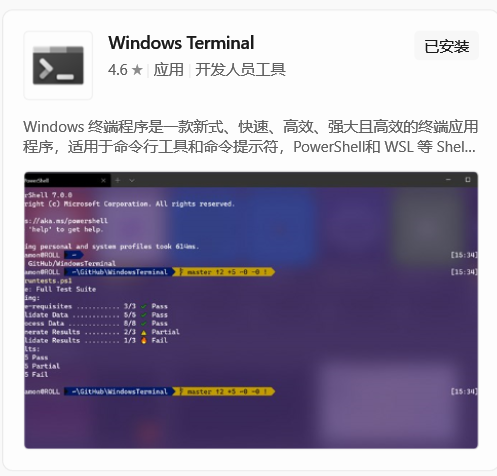
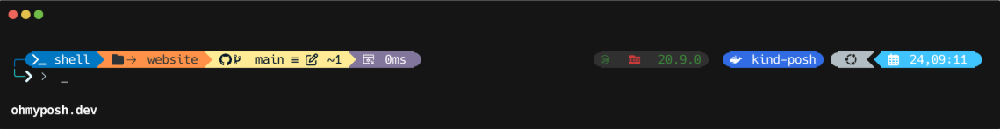

# 花里胡哨的win终端

---

## 一、前期准备工作

1、安装windows terminal，直接去微软应用商店搜索下载就可以了。


2、安装新版本的PowerShell 7 (Core)，它更快、更强，而且背景默认是黑色的。
在旧版powershell终端中使用命令：

```shell
winget install --id Microsoft.Powershell --source winget
```

安装完成后重启终端，进入设置界面，选择启动的默认配置文件为我们新安装的PowerShell 7。

3、安装 Oh My Posh 

```shell
winget install JanDeDobbeleer.OhMyPosh -s winget
```

4、安装图标包（给 ls 命令增加图标）
```shell
Install-Module -Name Terminal-Icons -Repository PSGallery -Force
```

5、设置自动补全功能
通常 PowerShell 7 自带了这个模块，如果没有，可以运行：
```shell
Install-Module PSReadLine -Force
```

6、安装Nerd Font字体，官网地址：[font-downloads](https://www.nerdfonts.com/font-downloads)下载一款字体，推荐 "JetBrainsMono Nerd Font"。字体建议选择JetBrainsMonoNerdFont-*，这是完整版，可以开启连字符。安装完成后继续进入终端的设置界面，选择默认字体为我们刚安装的这款。。如果不安装Nerd Font的话，会造成无法显示一些图标。

## 二、配置Oh My Posh

1、设置主题路径
可以在`C:\Users\"你的用户名"`目录下面创建一个`.poshthemes`文件夹，后面把拉取的相关主题配置都存放在这里。

2、去官网：[官网主题地址](https://ohmyposh.dev/docs/themes)选择一个你喜欢的主题，然后将配置文件`***.omp.json`拉取到我们上面创建的目录中。官网中也有相应的配置文档可供参考。我个人使用的是atomic主题。官网示例如图：


3、修改启动配置文件 ($PROFILE)
在 PowerShell 中输入：
```shell
notepad $PROFILE
```
>(如果提示找不到文件，就选择“是”创建它)

然后在记事本中写入下面的配置：
```shell
# 1. 引入 Oh My Posh 主题（注意你的路径是否正确）
oh-my-posh init pwsh --config "$HOME\.poshthemes\你拉取的主题名.omp.json" | Invoke-Expression

# 2. 引入文件图标 (ls 时显示图标)
Import-Module -Name Terminal-Icons

# 3. 开启 PSReadLine 智能补全
Set-PSReadLineOption -PredictionSource History   # 基于历史记录预测
Set-PSReadLineOption -PredictionViewStyle ListView # 列表式显示预测(可选，如果不习惯可以删掉这行)
```

之后保存并重启终端，后面想更换主题的时候只需要拉取相应的主题配置，并修改配置文件中的主题名即可。

* tips：可以尝试一下使用Tabby来代替Windows Terminal，能配置的更加花里胡哨~~~，并且也有很多更好用的功能，我已经用它来替代xshell使用了。